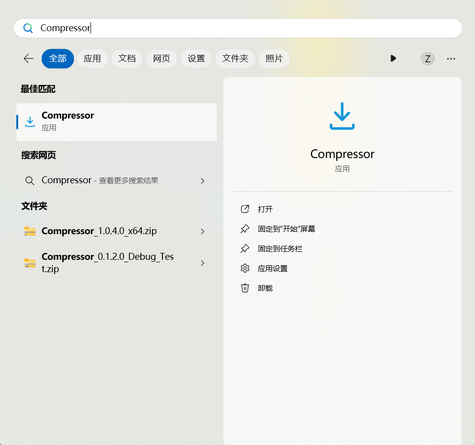
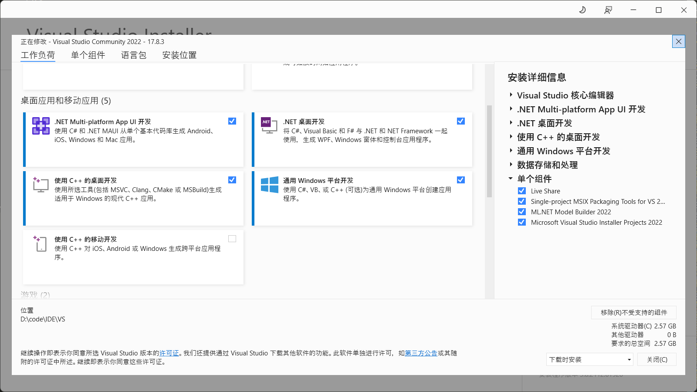
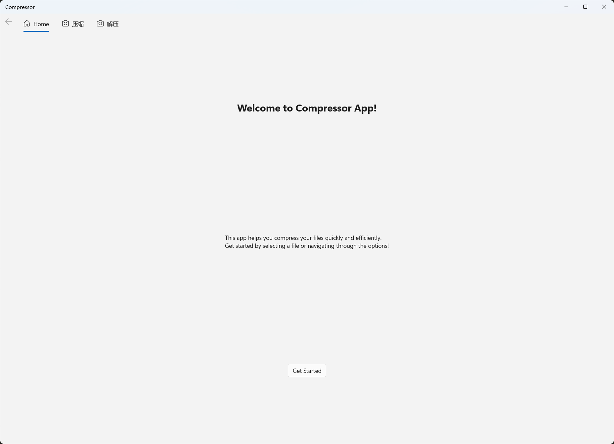
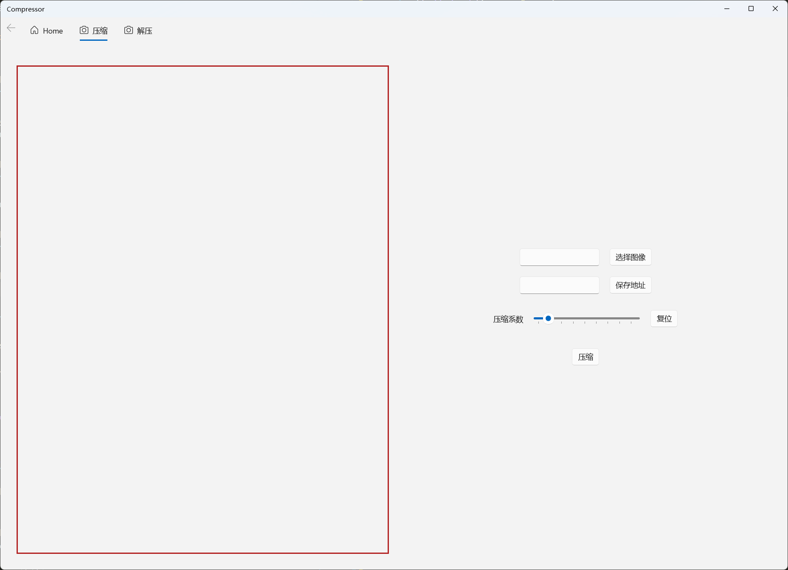
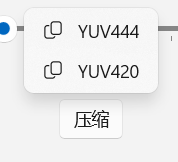
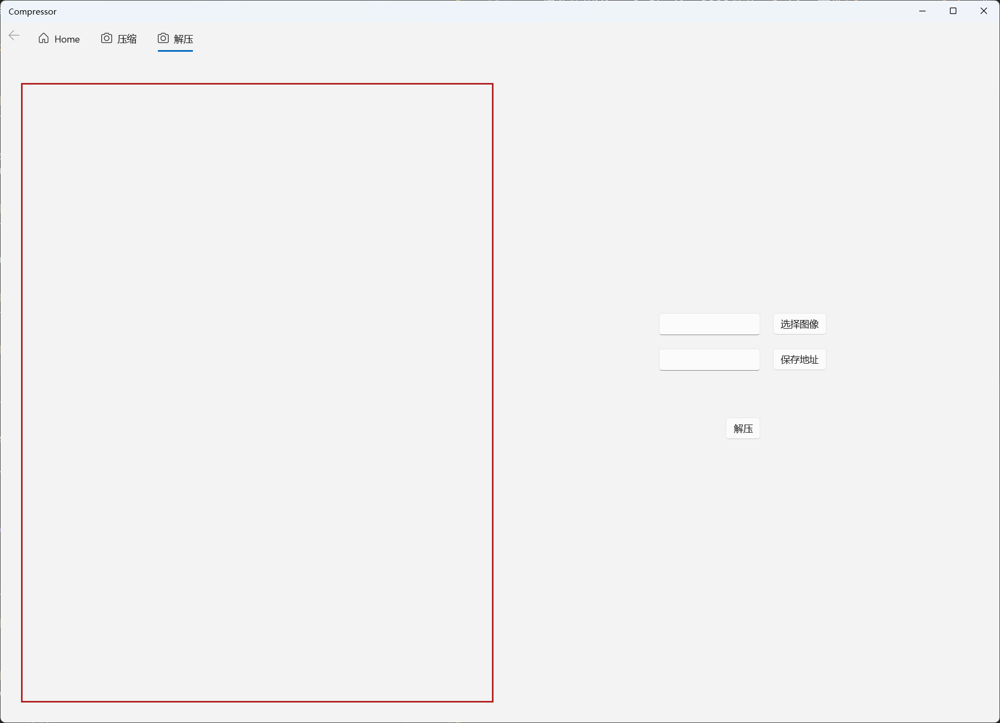

<h1>类JPEG的图像有损压缩与解压程序使用手册</h1>

# 1. 环境要求

+ Windows10/11 21H2及以上(本人使用Windows11 23H2)

# 2 使用方法

## 2.1 安装

### 2.1.1 直接安装

1. 右键Install.ps1, 使用PowerShell运行, 应用程序将会作为UWP应用安装在Windows中
2. 在开始菜单中找到或搜索`Compressor`, 即可找到安装后的应用程序

### 2.1.2 源码编译运行

+ 推荐使用Visual Studio 2022打开solution文件`Compressor.sln`, 要求VS已经安装了C#/.NET相关的依赖(图中的通用Windows平台开发为必要依赖)

## 2.2 使用

### 2.2.1 压缩

1. 单击`Get Started`按钮或使用上方导航栏可以进入压缩页面

2. 点击选择图像选择需要压缩的图像，然后点击保存地址选择压缩后的图像保存地址

3. 压缩系数可以进行调整，也可以保持默认的1，点击压缩，选择希望使用的下采样方式即可开始压缩
+ 

4. 压缩完成会出现弹窗通知

### 2.2.2 解压

1. 单击导航栏上的解压进入解压界面

2. 选择需要解压的图像(`.hufimg`)，然后选择解压后的图像保存地址

3. 点击解压，等待解压结束弹窗即可